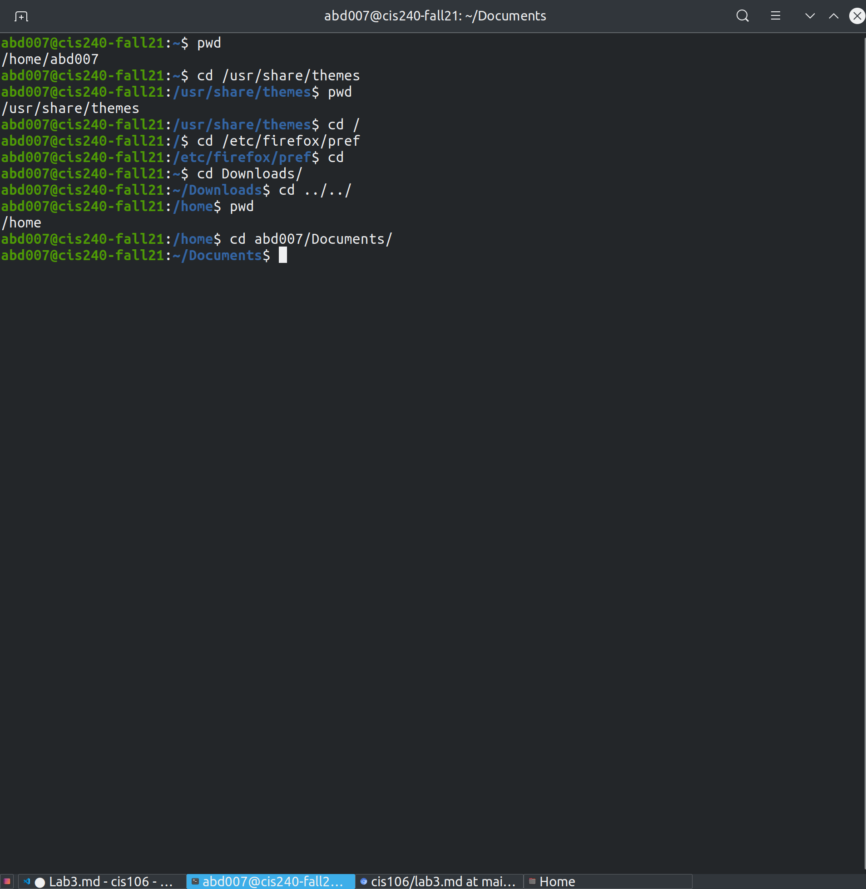
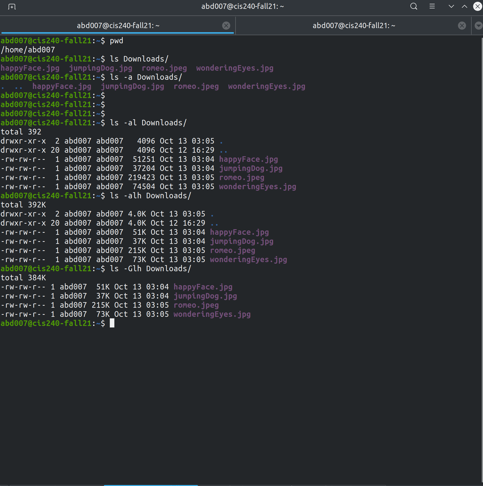
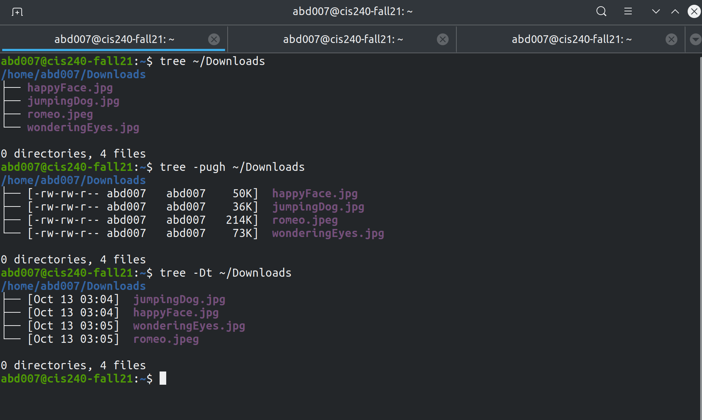
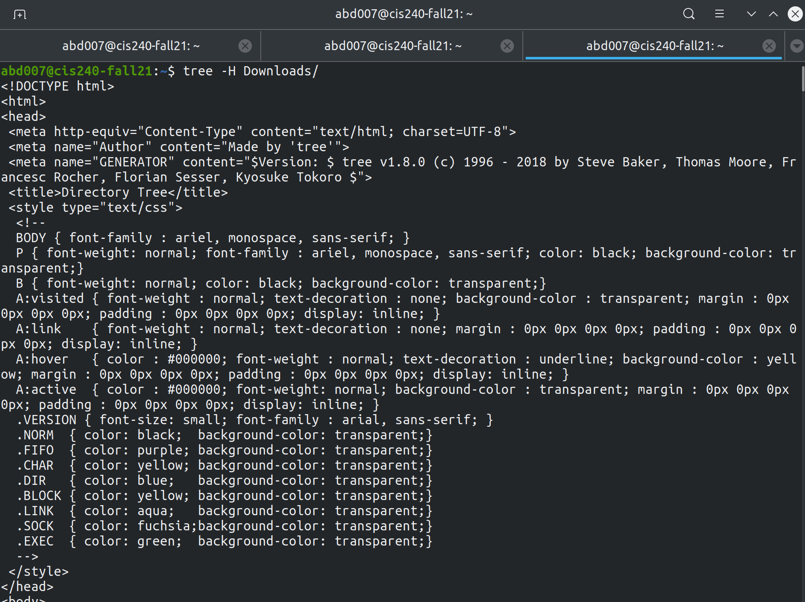
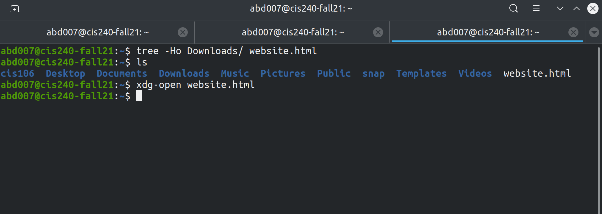
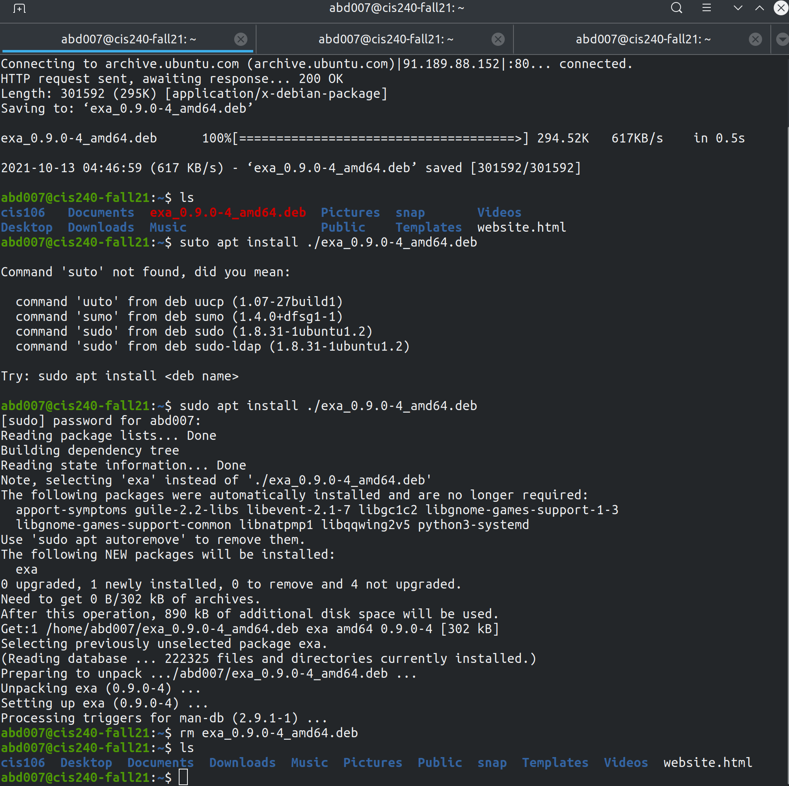
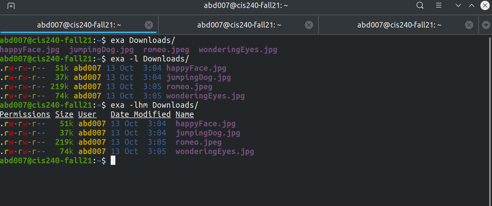

# Lab 3 | Installing software and navigating the file system | Answers
Assignment description [here](https://raw.githubusercontent.com/ra559/cis106/main/labs/lab3.md)

## Question 1
1. Which command did you use to search for the themes and to install theme?
   Ans: to search: apt search 'gtk theme'
        to install: sudo apt install breeze-gtk-theme

2. Which commands did you use to find and install the web browser?
   Ans: to find: apt search web browser
        to install: sudo apt install doc-central

3.1 What is the name of the package?
    Ans: doc-central
    

3.2 What dependencies are needed in order to install the package? (you can either take a screenshot of the terminal or copy and paste from the terminal)
    Ans: apache2 | httpd-cgi, doc-base (>= 0.8.10), info2www, python3, python3-debian, sensible-utils

3.3 How much disk space will the package utilize after installation?
    Ans: 63.5 kb
 

## Question 2

## Question 3

## Question 4

## Question 5

