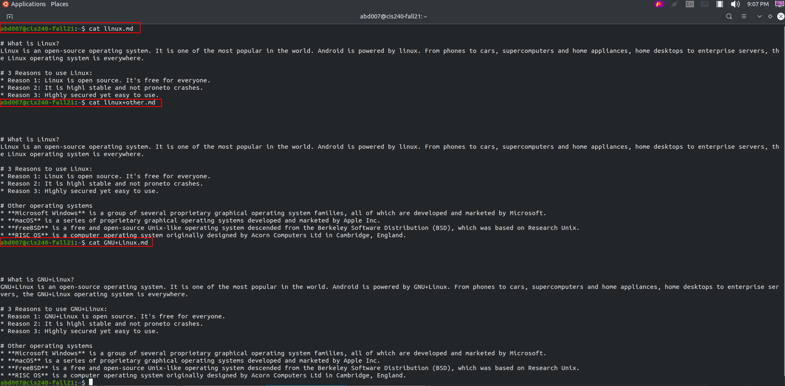

# Lab 6 | Using VIM

## Question 2

## URL of the markdown file linux
[linux.md](https://github.com/almumin91/cis106/blob/main/Labs/linux.md)

## URL of the markdown file linux+other
[linux+other.md](https://github.com/almumin91/cis106/blob/main/Labs/linux%2Bother.md)

## URL of the markdown file GNU+Linux
[GNU+Linux.md](https://github.com/almumin91/cis106/blob/main/Labs/GNU%2BLinux.md)

## End of Lab 6