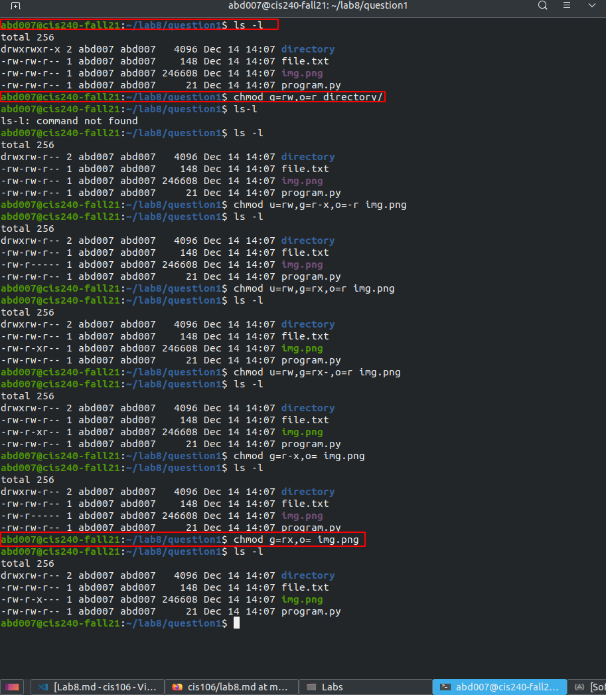
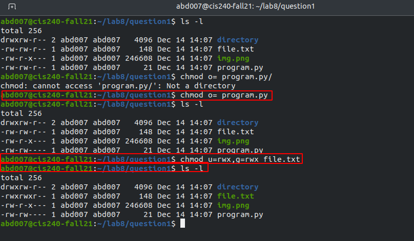
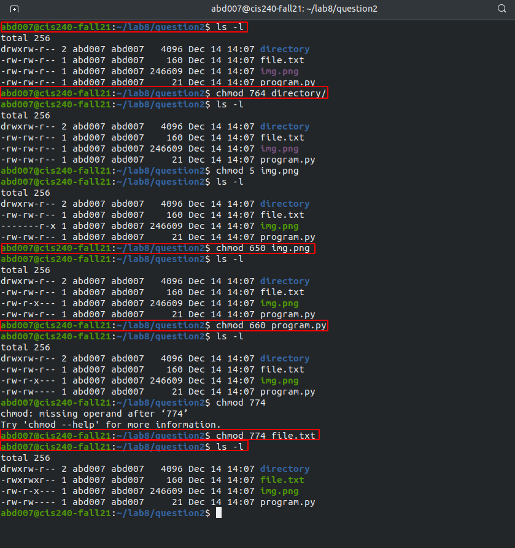
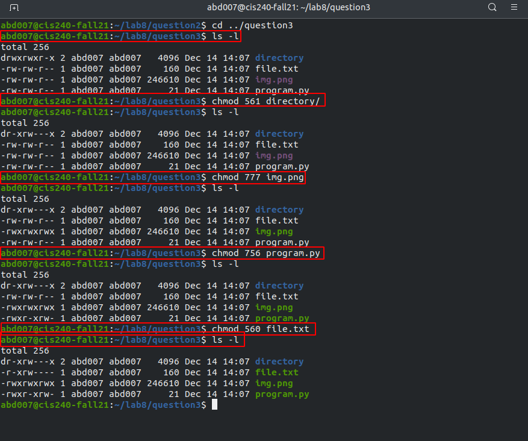
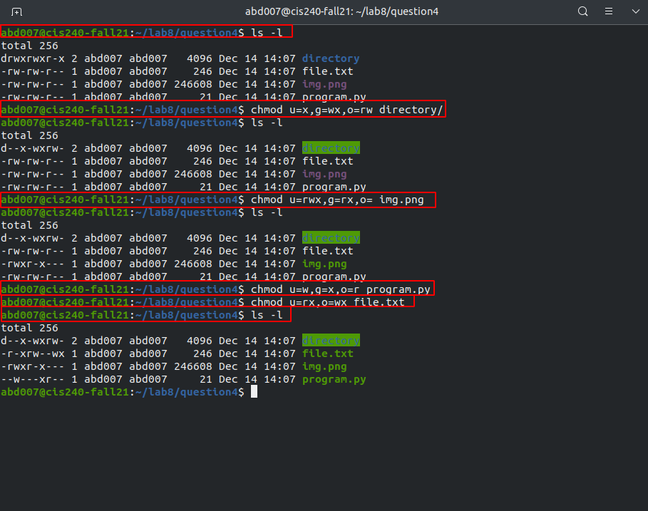

# Lab 8 | File Permission

## Question 1: Using Symbolic Notation
### Ans:  

## Question 2: Using Numeric Notation
### Ans: 

## Question 3: Using Numeric Notation
### Ans: 

## Question 4: Using Symbolic Notation
### Ans: 